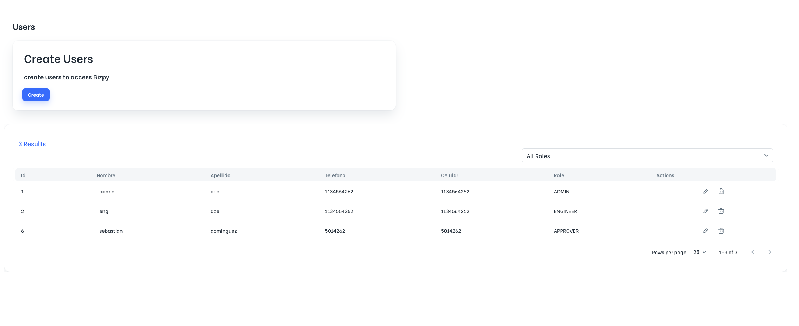
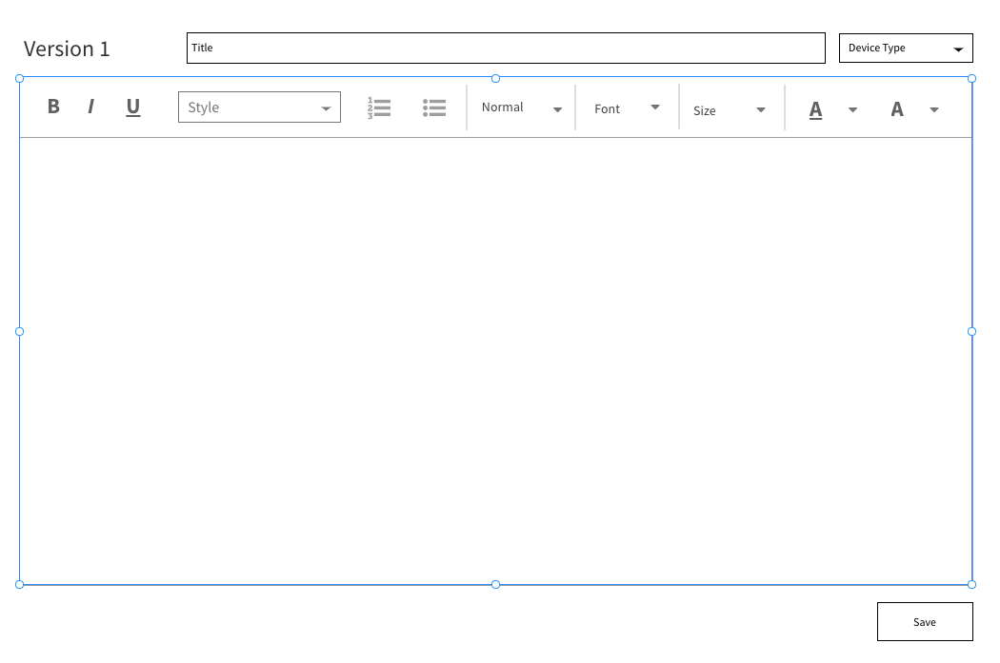

# Code structure

## Client React App
- Is in the folder `/client`.
- Check it's [README.md](./client/README.md) to know how to run it.

## Typescript Backend App
- Is in the folder `/server`.
- Check it's [README.md](./client/README.md) to know how to run it.

# Task

Create a CRUD for Template objects. a template is a object that holds information about a Cisco IOs configuration of a Cisco Networking Device. it could be a router a switch etc etc.

The following is a definition of that object:

it's a json specification because you should mock all requests to back end.

```json
 { 
     "id": 1,
     "version": 1,
     "config": "the config",
     "device_type": "ROUTER | SWITCH | AP | ETC",
     "createdAt": "date iso",
     "updatedAt": "date iso",
 }
```

in /templates path you should show the main page for the crud, it would be like the following image , but with the template's information.




when the user click on create button you should go to /template to create a new template like this:



And when you click in the edit icon, you suould go to template/:id path, where id is the id of the template. whe you update the template you should increase the version and create the new version.


One important thing is that the editor should be [monaco editor](https://microsoft.github.io/monaco-editor/) (you could use any react monaco editor library ) , and the syntax shoul be [Cisco IOS Syntax](https://marketplace.visualstudio.com/items?itemName=jamiewoodio.cisco) or similar.


